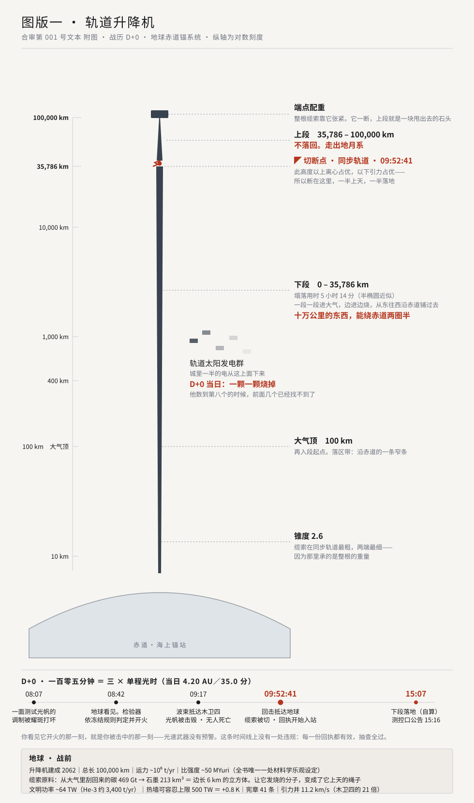

# 卷一 · 图版一 · 轨道升降机

> 文体：合审第 001 号文本 附图（战后）
> 落款：战历 D+1008
> 位置：第 1 章之后，第 2 章〈引言〉之前

---

---

## 图注

**本图为战后复原，不代表任何一方在 D+0 当日所知。**

D+0 当日，地球一侧无人知道那一百零五分钟的第一项是一面测试光帆。窗前那个人能拿到的只有两样东西：一队时间戳，和一个距离。他把距离乘以八点三一七，得到三十五分钟；把三十五分钟乘以三，得到一百零五分钟。**这就是当日一个地球人能够独立复原的全部因果。**

关于本图上的三件事，合审在此说明：

**一、切断点在同步轨道，不是选的，是算的。**该高度以上离心占优，以下引力占优。任何一次足以切断缆索的照射，其后果都由这条分界线决定：上段甩出地月系，下段塌落。开火一方无须知道这条分界线在哪里——**分界线不由开火的人决定，由这颗行星的自转周期决定。**

**二、缆索、发电群、中继、阵列，在目标分类表上属于同一类。**分类表第 F 类的定义是"不可机动固定资产"。它写于战前九年，写它的人不知道自己在写一份名单。**该分类在两边宪章下均属合规，至今未被任何一方援引为过错。**

**三、本图不含任何一方的伤亡数字。**D+0 当日，两边合计死亡人数为零。战争的第一具尸体是一面镜子；第二批是所有不会动的东西。

---

## 地球 · 战前设定摘要

> 本表所列均可自 `docs/02-物理正典.md` §十一与 `docs/03-世界观.md` §二复算。

| 项 | 值 | 算法／出处 |
|---|---|---|
| **文明总功率** | **~64 TW** | He-3 约 3,400 t/yr 供全年一次能源 |
| **热墙** | 吸收 240 W/m² × 5.1×10¹⁴ m² = **1.22×10¹⁷ W**；λ ≈ 0.8 K/(W/m²) | 64 TW → +0.10 K（**刚刚可测——小说时代热墙才被发现**）；500 TW → +0.8 K（可容忍上限） |
| **关键约束** | **热不可过滤** | CO₂ 是物质，可分离封存；废热是通量，唯一出口是从大气顶辐射走。**少留热只有两条路：少产热，或少接收阳光** |
| **碳账** | 500→280 ppm ＝ 1,718 Gt CO₂ × 2 GJ/t ＝ 3.44×10²¹ J | **以 100 TW 专供 1.1 年**。碳危机不是被努力解决的，是功率跨过门槛之后顺手解决的 |
| **碳的去向** | 469 Gt 碳 → 石墨 **213 km³** ＝ 边长 **6 km** 的立方体 | 下游即升降机缆索 |
| **升降机** | 建成 **2062**；总长 **100,000 km**；同步轨道 **35,786 km**；锥度 **2.6**；运力 **~10⁶ t/yr** | 特征势能 48.5 MJ/kg；**需比强度 ~50 MYuri——全书唯一一处依赖未实现材料突破的设定，明记于 `02` §十一** |
| **轨道太阳发电群** | LEO/GEO，σ ≈ 0 | **拦的是本来就会错过地球的光——每一瓦下传都是净新增的热。**小说时代是零头，问题尚未成为问题 |
| **引力井** | 逃逸 **11.2 km/s**；出井单位质量能量为木卫四的 **21 倍** | 11.2²/2.44² |
| **有电梯之后** | 便宜的是**货**，不是人 | 行星际迁徙仍走聚变客船；移民高峰 2080–2140 累计约地球人口的 1% |
| **宪章** | **41 条**，印在纸上 | 卡利斯托 44 条（多三条自己通过的修正案） |
| **战前失去什么** | 升降机、发电群、行星际枢纽 | **开战首日退回地面。地球没有死，地球被降级** |

**这张表里没有一个数是为了好看。**每一个都可以拿计算器验。

---

## 制作说明（不进正文）

- 源文件：`manuscript/卷一/图/图一-轨道升降机.svg`（矢量，随库版本管理，无外部依赖，明暗两套配色）
- 纵轴为**对数刻度**，图上已标注——否则 100 km 与 100,000 km 无法同框
- 塌落用时 **5 小时 14 分**取半椭圆近似 π√(a³/μ)，a = (r_GEO + R_E)/2 = 24,271 km → 18,816 s。**该模型在正文中由人物自述偏快**（未计大气与缆索强度，两者都往慢里拖），与测控口公告 15:16 差 9 分钟，方向正确
- 对照：纯径向自由落体 **4 h 07 min**（忽略初始 3.075 km/s 周速）；旋转系内自静止下落 **35 h 23 min**（同步轨道处净力为零，会滞留）。真实共转缆索被下方质量拖着走，介于两者之间
